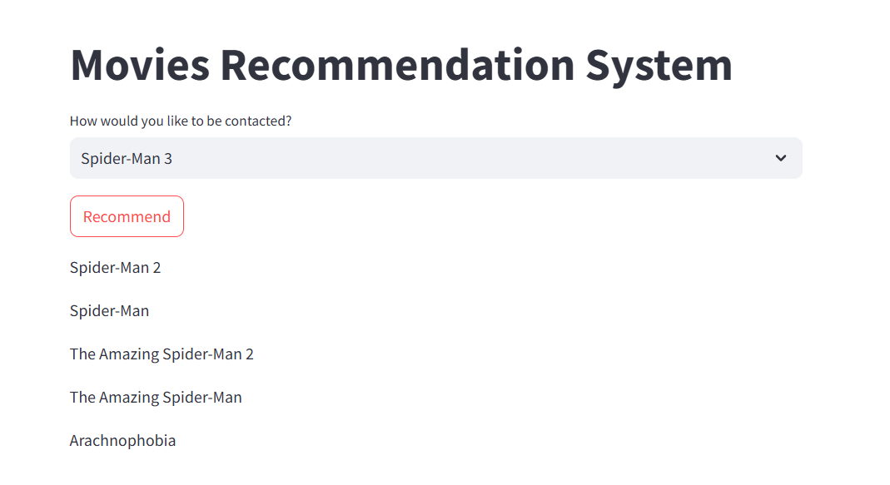
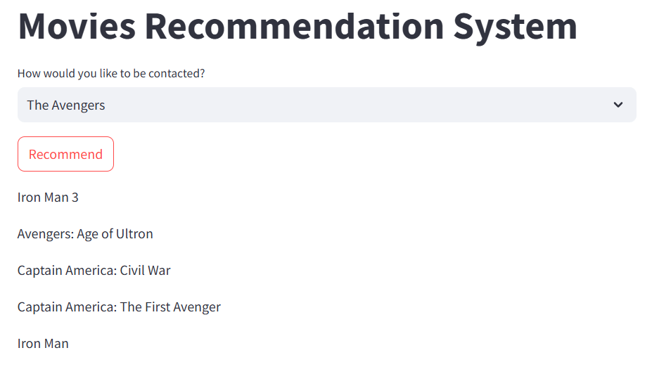

# 🎬 Movie Recommender System (TMDb Dataset)

Welcome to the **Movie Recommender System**! This project leverages the **TMDb (The Movie Database)** dataset to recommend movies to users based on their preferences. The system uses both **Collaborative Filtering** and **Content-Based Filtering** techniques to suggest the best movies.

## 🌟 Features

- **Movie Data:** Uses detailed movie data like title, genre, ratings, and more from the TMDb dataset.
- **Recommendation Algorithms:**  
  - Collaborative Filtering (based on user-item interactions)
  - Content-Based Filtering (based on movie features)
- **User Preferences:** Recommends movies tailored to user preferences or similar movie choices.

## Spider-Man Recommendations
<p align="center">
  
  
</p>


## 📥 Installation

To get started, follow these steps:

1. **Clone this repository:**
   ```bash
   git clone https://github.com/ashish-kumar-2017/movie-recommender-system-tmdb-dataset-main.git
2. **Install required dependencies:**
   ```bash
   pip install -r requirements.txt

## 🖥️ Usage

To use the Movie Recommender System, follow these steps:

1. **Load the Dataset**

2. **Select a Recommendation Method**

3. **Input Preferences**

4. **Receive Recommendations**

5. **(Optional) Deploy the System**


## 🔧 Technologies Used

- **Python** for backend development
- **Pandas** and **Numpy** for data processing
- **Scikit-learn** for machine learning algorithms
- **Flask** (optional, if used for deployment)

## 📝 Acknowledgments

- **TMDb (The Movie Database)** for providing the movie dataset.
- **Scikit-learn** for offering machine learning tools and algorithms.
- Inspiration from various recommender system research papers and tutorials.

---

Enjoy discovering new movies! 🍿

